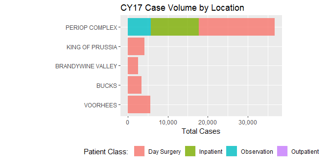

-   [Introduction](#introduction)
-   [Barplots](#barplots)
    -   [The Basics](#the-basics)
    -   [Formatted Barplot](#formatted-barplot)
        -   [Fill Option](#fill-option)
        -   [Remove Legend](#remove-legend)
        -   [Custom colors](#custom-colors)
        -   [Bar Plot Variations](#bar-plot-variations)
            -   [Stacked bar plot](#stacked-bar-plot)
            -   [Dodged Bar plot](#dodged-bar-plot)
            -   [Filled Percentage Bar Plot](#filled-percentage-bar-plot)
        -   [Facetted Bar Plot](#facetted-bar-plot)
-   [Line Plots](#line-plots)
    -   [The Basics](#the-basics-1)
    -   [Formatted Lineplot](#formatted-lineplot)
        -   [Multi-Line Plot](#multi-line-plot)
        -   [Reference Lines](#reference-lines)
-   [Scatterplots](#scatterplots)
    -   [The Basics](#the-basics-2)
    -   [Coloring a Scatterplot](#coloring-a-scatterplot)
-   [Boxplots](#boxplots)
    -   [The basics](#the-basics-3)
    -   [Horizontal layout](#horizontal-layout)
    -   [Formatting](#formatting)
    -   [Handling outliers](#handling-outliers)
    -   [Plotting everything (no comparison)](#plotting-everything-no-comparison)
    -   [Aggregated data](#aggregated-data)
    -   [Violin Plots](#violin-plots)
-   [Reference lines](#reference-lines-1)
    -   [hline & vline](#hline-vline)
-   [Histograms](#histograms)
    -   [Adjusting \# of bins](#adjusting-of-bins)
    -   [Adjusting bin intervals](#adjusting-bin-intervals)
-   [Facet layouts](#facet-layouts)
    -   [facet\_grid: one column by another column](#facet_grid-one-column-by-another-column)
        -   [Only 1 split and using the period `.`](#only-1-split-and-using-the-period-.)
        -   [labeller](#labeller)
        -   [switch](#switch)
    -   [facet\_wrap: one column repeating in a grid](#facet_wrap-one-column-repeating-in-a-grid)
        -   [Specifying rows and column parameters](#specifying-rows-and-column-parameters)
    -   [Advanced tips](#advanced-tips)
        -   [scales & space](#scales-space)
        -   [layers within facets](#layers-within-facets)
-   [Plotting dates](#plotting-dates)
    -   [Angled text](#angled-text)
    -   [quarters](#quarters)
    -   [some other approaches](#some-other-approaches)
        -   [facets](#facets)
        -   [year-over-year comparisons](#year-over-year-comparisons)
    -   [date formats](#date-formats)
-   [Nice HTML Tables](#nice-html-tables)
    -   [Basic Tables](#basic-tables)
    -   [Advanced Tables](#advanced-tables)

<style type="text/css">

    body{ /* Normal  */
          font-size: 14px;
      }

 </style>
<script>
    $(document).ready(function() {
      $items = $('div#TOC li');
      $items.each(function(idx) {
        num_ul = $(this).parentsUntil('#TOC').length;
        $(this).css({'text-indent': num_ul * 10, 'padding-left': 0});
      });
    
    });
</script>
Introduction
============

This tutorial is designed to go over the common chart types and formatting options of ggplot2. It is not exhaustive, but is enough to get you up and running if you're a first time user and serve as a quick reference guide as you continue to learn R. First, let's load these libraries.

``` r
library(tidyverse) #data manipulation & visualization: ggplot2, dplyr, tidyr, readr
library(ggthemes)  #colors for ggplot2
library(scales)    #formatting axes and labels in ggplot2
library(lubridate) #easy manipulate date formats
library(forcats)   #change default sort or grouping of data
library(gridExtra) #for plotting multiple charts at once
library(kableExtra)
#install.packages('formattable')
#install.packages('RCurl')
library(RCurl)
library(formattable)
```

Barplots
========

The Basics
----------

Let's read in the data, format it, and do a simple plot of the total number of cases at Main ORs and each ASC:

``` r
path <- getURL("https://raw.githubusercontent.com/chop-analytics/chopR/develop/Data%20Viz%20Guides-Templates/Rmd/Data/ggplot_demo_data.csv")
cases <- 
    read_csv(path) %>% 
    mutate(surgery_date = lubridate::mdy(surgery_date),
           arrival_time = lubridate::mdy_hm(arrival_time),
           scheduled_surgery_time = lubridate::mdy_hm(scheduled_surgery_time),
           hour_arrive = hour(arrival_time),
           hour_surgery = hour(scheduled_surgery_time),
           month_surgery = as.factor(month(scheduled_surgery_time)),
           year_surgery = year(scheduled_surgery_time),
           am_pm = ifelse(hour_surgery < 12, "AM", "PM")
           )
```

``` r
#cases by location
loc <- cases %>%
  dplyr::group_by(location) %>%
  dplyr::summarise(count = n())

ggplot(loc, aes(x=location, y=count)) + 
  geom_bar(stat="identity")
```


Formatted Barplot
-----------------

That looks pretty bad. Let's format it a little more! We are going to change the default order, introduce some transparency and change the color, format the y axis, flip the plot, add a simple theme and add some labels:

``` r
ggplot(loc, aes(x=reorder(location, count), y=count)) + 
  geom_bar(stat="identity", alpha = .8, fill = "dodgerblue") + 
  scale_y_continuous(labels=comma) + 
  coord_flip() + 
  ggthemes::theme_hc() + 
  labs(x= " ", 
       y = "Total Cases", 
       title = "CY17 Case Volume by Location")
```


### Fill Option

If you want each bar to be its own color, use `fill = location` and remove the `fill` option from `geom_bar`. ggplot will pick some colors for you

``` r
ggplot(loc, aes(x=reorder(location, count), y=count, fill = location)) + 
  geom_bar(stat="identity", alpha = .8) + 
  scale_y_continuous(labels=scales::comma) + 
  theme(aspect.ratio = 1/1.6, legend.position = "bottom") +
  coord_flip() + 
  labs(x= " ", 
       y = "Total Cases", 
       title = "CY17 Case Volume by Location")
```


### Remove Legend

Using `fill` adds a legend. To remove it, add the following:

``` r
ggplot(loc, aes(x=reorder(location, count), y=count, fill = location)) + 
  geom_bar(stat="identity", alpha = .8) + 
  scale_y_continuous(labels=comma) + 
  coord_flip() + 
  labs(x= " ", 
       y = "Total Cases", 
       title = "CY17 Case Volume by Location") + 
  theme(legend.position = "none")
```


### Custom colors

To add your own colors, use the following:

``` r
ggplot(loc, aes(x=reorder(location, count), y=count, fill = location)) + 
  geom_bar(stat="identity", alpha = .8) + 
  scale_y_continuous(labels=comma) + 
  coord_flip() + 
  labs(x= " ", 
       y = "Total Cases", 
       title = "CY17 Case Volume by Location") + 
  theme(legend.position = "none") + 
  scale_fill_manual(values = c("dodgerblue", "darkgray", "pink", "Green", "orange"))
```


### Bar Plot Variations

#### Stacked bar plot

Let's now to a stacked bat plot of total case volume at each location by patient class. In this case I want to keep the legend. By default ggplot will use the column name as the legend name which is \``patient_class`. See the last layer of the code to rename the legend

``` r
pat_class <- cases %>%
  group_by(location, patient_class) %>%
  summarise(count = n())

ggplot(pat_class, aes(x=reorder(location, count), y=count, fill = patient_class)) + 
  geom_bar(stat="identity", alpha = .8, position = "stack") + 
  scale_y_continuous(labels=scales::comma) + 
  coord_flip() + 
  theme(aspect.ratio = 1/1.6, legend.position = 'bottom') +
  labs(x= " ", 
       y = "Total Cases", 
       title = "CY17 Case Volume by Location") + 
  guides(fill=guide_legend(title="Patient Class: ")) 
```



#### Dodged Bar plot

Next is a side-by-side, or "dodged", bar plot of comparing 3 services at each site: General Surgery, Otolaryngology, and Plastic Surgery. Adding `group = service` and `position = "dodge"` will accomplish this.

``` r
svc <- cases %>%
  filter(service %in% c("General Surgery", "Otolaryngology", "Plastic Surgery")) %>%
  group_by(location, service) %>%
  summarise(count = n())

ggplot(svc, aes(x=reorder(location, count), y=count, group = service, fill = service)) + 
  geom_bar(stat='identity', alpha = .8, position = "dodge") + 
  scale_y_continuous(labels=comma) + 
  coord_flip() + 
  labs(x= " ", 
       y = "Total Cases", 
       title = "CY17 Case Volume by Location") + 
  guides(fill=guide_legend(title="Patient Class: "))
```


#### Filled Percentage Bar Plot

It looks like ENT does the most cases, but what is the percentage breakdown of each service? Calculating a proportion and then using `position = "fill"` and adding a `geom_text` layer can tell us that.

``` r
svc <- cases %>%
  filter(service %in% c("General Surgery", "Otolaryngology", "Plastic Surgery")) %>%
  group_by(location, service) %>%
  summarise(count = n()) %>%
  mutate(total = sum(count), 
         prop = round(count/total,2))

ggplot(svc, aes(x=reorder(location, count), y=count, group = service, fill = service)) + 
  geom_bar(stat='identity', alpha = .8, position = "fill") + 
  scale_y_continuous(labels=scales::percent) + 
  coord_flip() + 
  labs(x= " ", 
       y = "Total Cases", 
       title = "CY17 Case Volume by Location") + 
  guides(fill=guide_legend(title="Patient Class: ")) + 
  geom_text(aes(label= paste(prop*100, "%", sep="")), position = position_fill(vjust = .5))
```


### Facetted Bar Plot

We can view monthly total case volumes separately for each location using faceting. This can be helpful because each location can be viewed alone, but in relation to the other locations since the scale of the y-axis is fixed. The main ORs really stand out in terms of monthly volume in relation to the ASCs.

``` r
monthly <- cases %>%
  mutate(month_year = lubridate::floor_date(surgery_date, "month")) %>%
  group_by(month_year, location) %>%
  summarise(count = n())

ggplot(monthly, aes(x=month_year, y=count, fill = location)) + 
  geom_bar(stat='identity', alpha = .8) + 
  scale_y_continuous(labels=comma) + 
  labs(x= " ", 
       y = "Total Cases", 
       title = "CY17 Case Volume by Location") + 
  theme(legend.position = "none") + 
  scale_x_date(breaks = scales::date_breaks("3 months"), date_labels = "%b %Y") + 
  theme(axis.text.x = element_text(angle = 45, hjust = 1)) + 
  facet_wrap(~location)
```


You can use `scales = "free"` in `facet_wrap` to allow each plot to re-size itself, but it makes comparisons harder.

``` r
ggplot(monthly, aes(x=month_year, y=count, fill = location)) + 
  geom_bar(stat='identity', alpha = .8) + 
  scale_y_continuous(labels=comma) + 
  labs(x= " ", 
       y = "Total Cases", 
       title = "CY17 Case Volume by Location") + 
  theme(legend.position = "none") + 
  scale_x_date(breaks = scales::date_breaks("3 months"), date_labels = "%b %Y") + 
  theme(axis.text.x = element_text(angle = 45, hjust = 1)) + 
  facet_wrap(~location, scales = 'free')
```


------------------------------------------------------------------------

Line Plots
==========

Many of the Bar Plot examples can be made into line plots by changing `geom_bar()` to `geom_line()`. One important distinction between bar plots and line plots using ggplot2 is that to specify colors in a line plot, use `color = ...` instead of `fill = ...`.

The Basics
----------

Here is a line plot of monthly case volume at the Main ORs

``` r
#cases by location
main_monthly <- cases %>%
  filter(location == 'PERIOP COMPLEX') %>%
  mutate(month_year = floor_date(surgery_date, "month")) %>%
  group_by(month_year) %>%
  summarise(count = n())

ggplot(main_monthly, aes(x=month_year, y=count)) + 
  geom_line()
```


Formatted Lineplot
------------------

let's format it a little but more by adding some color, points at each month and some labels. We can also add a smooth line to help show a trend.

``` r
ggplot(main_monthly, aes(x=month_year, y=count)) + 
  geom_line(size = 1.2, color = "dodgerblue") + 
  geom_point(size=2, color = "dodgerblue") +
  geom_smooth(se=F, method = 'loess', color = 'darkgray') + 
  scale_y_continuous(labels = comma) + 
  labs(x=" ", y = "Total Cases", title = "Total Monthly Case Volume", subtitle = "Periop Complex Only")
```


### Multi-Line Plot

Let's look at all locations. Note we need to specify the `group()` and `color()` arguments in order to distinguish between locations

``` r
all_loc_monthly <- cases %>%
  mutate(month_year = floor_date(surgery_date, "month")) %>%
  group_by(location, month_year) %>%
  summarise(count = n())

ggplot(all_loc_monthly, aes(x=month_year, y=count, group = location, color = location)) + 
  geom_line(size = 1.2) + 
  geom_point(size=2) +
  geom_smooth(se=F, method = "loess") + 
  scale_y_continuous(labels = comma) + 
  labs(x=" ", y = "Total Cases", title = "Total Monthly Case Volume")
```


### Reference Lines

Let's add a reference line for the average monthly case volume for the Main Periop Complex Plot. First we need to add the overall mean to the dataframe and then in the plot statement, add a `geom_hline()` layer and an `annotate()` layer.

``` r
main_monthly <- cases %>%
  filter(location == 'PERIOP COMPLEX') %>%
  mutate(month_year = floor_date(surgery_date, "month")) %>%
  group_by(month_year) %>%
  summarise(count = n()) %>%
  mutate(avg_cases = round(mean(count), 0))

ggplot(main_monthly, aes(x=month_year, y=count)) + 
  geom_line(size = 1.2, color = "dodgerblue") + 
  geom_point(size=2, color = "dodgerblue") +
  geom_hline(aes(yintercept = avg_cases), color = "black", linetype = 'dashed') + 
  annotate("text", x = as.Date("2016-03-15"), y = 1500, label = paste("mean:\n", unique(main_monthly$avg_cases), "cases", sep=" ")) +
  scale_y_continuous(labels = comma) + 
  labs(x=" ", y = "Total Cases", title = "Total Monthly Case Volume", subtitle = "Periop Complex Only")
```


Scatterplots
============

The Basics
----------

Here is a scatterplot of daily procedure volume over time at the main ORs.

``` r
daily_main <- cases %>%
  filter(location == 'PERIOP COMPLEX') %>%
  mutate(day = floor_date(surgery_date, "day")) %>%
  group_by(day) %>%
  summarise(count = n())

ggplot(daily_main, aes(x=day, y=count)) + 
  geom_point() + 
  labs(x=" ", y="Total Cases", title = "Daily Case Volume", subtitle = "Periop Complex Only")
```


Coloring a Scatterplot
----------------------

The plot revealed something interesting - there seems to be 2 groups in the data. We can use colors to explore the data some more.

``` r
daily_main <- cases %>%
  filter(location == 'PERIOP COMPLEX') %>%
  mutate(day = floor_date(surgery_date, "day"),
         day_nm = lubridate::wday(surgery_date, label = T, abbr = T)) %>%
  group_by(day, day_nm) %>%
  summarise(count = n())

ggplot(daily_main, aes(x=day, y=count, color = day_nm)) + 
  geom_point(size = 2, alpha = .7) + 
  labs(x=" ", y="Total Cases", title = "Daily Case Volume", subtitle = "Periop Complex Only") + 
  guides(color=guide_legend(title="Day of Week")) + 
  theme(legend.position = "bottom")
```


Boxplots
========

The basics
----------

Also known as 'box-and-whisker' charts, boxplots are a great way to show the distribution of your data and to compare distributions between groups. To read a boxplot, each section of the plot represents 25% of the data. The line to the left side is lowest 25th percetile, the beginning of the box is the next 25th percentile with the middle vertical line representing the 50th percentile (median). The end of the box is the 75th percentile and the end of the line is the 100th percentile or close to it. Any outliers are represented as dots.

A boxplot that has equal sections represent **normally distributed** observations 

Box plots that have squished sections represent **skewed** or concentrated values 

Here is an example of the time it takes to complete a procedure. Note that the medians (middle lines) vary based on the different patient classes.

``` r
    ggplot(cases) +
        geom_boxplot(aes(x = patient_class, y = intraop_time))
```


Horizontal layout
-----------------

The first thing that you need to know is that your **categorical variables need to be on the X-axis.** You may (often) want to flip your boxplot horizontally to accomodate longer descriptions. If you try to switch `x` and `y`, you might get something that looks like this.

``` r
    ggplot(cases) +
        geom_boxplot(aes(x = intraop_time, y = patient_class))
```


If you want the chart to display horizontally, you will need to add **`+ coord_flip()`** to plot it horizontally.

``` r
    ggplot(cases) +
        geom_boxplot(aes(x = patient_class, y = intraop_time)) +
        coord_flip()
```


Formatting
----------

`geom_boxplot()` takes a variety of parameters both inside and outside of the `aes()`. `aes()` is always data driven. These are the aesthetics that are defined by values of your dataset. Arguments outside of `aes()` will be applied globally to the chart. For example, to make all charts have a consistent feature like a blue outline on each boxplot, you would write something like `geom_boxplot(aes(x = _ , y = _ ), color = "blue")` To make the charts have different outline colors based on some difference in the data, you would use something like `geom_boxplot(aes(x = _ , y = _ , color = class))`. Boxplots also have `outlier.____` arguments to change the appearance of outliers.

Below are the most common parameters you might change about a boxplot.

-   `color` = the outline of the boxplot
-   `fill` = the color of rectangles in the boxplot
-   `size` = line thickness/border of all boxplots
-   `varwidth` = width is dependent on group size (N)

for outliers: note - these follow the rules for points

-   `outlier.color` = if `NULL`, will default to match color in aes()
-   `outlier.size`
-   `outlier.alpha` = transparency (0-1)
-   `outlier.shape` = you can give a single character or use the values [shown here](https://ggplot2.tidyverse.org/reference/scale_shape.html)
    -   if shape takes a fill aesthetic
    -   `outlier.fill` = if null, will default to match fill in aes()
    -   `outlier.stroke` = outline thickness, color will be outlier.color

``` r
    ggplot(cases) +
        geom_boxplot(aes(x = patient_class, 
                         y = intraop_time,
                         color = patient_class),
                     fill = "white",
                     outlier.shape = "+",
                     outlier.color = "grey40",
                     outlier.size = 4,
                     outlier.alpha = 0.3) +
        coord_flip()
```


Handling outliers
-----------------

in general, you can adjust how "zoomed in" ggplots are by adjusting either `+ ylim(0, 400)` or `+ scale_y_continuous(limits = c(0, 400))`, however, this method is not advised for boxplots. Doing so will remove data points outside of your limits and re-calculate the quartiles. For boxplots you want to use either `+ coord_cartesian()` and specify the `ylim = c(start, end)` argument. You can also use `coord_flip` and specify the `ylim` argument as it inherently uses cartesian coordinates. Note below that I have used `coord_flip(ylim = c(0, 400))`. Remember, even though you have changed how `x` and `y` look, you need to refer to them as their original designations.

``` r
    ggplot(cases) +
        geom_boxplot(aes(x = patient_class, y = intraop_time), outlier.alpha = .1) +
        coord_flip(ylim = c(0, 400))
```


Plotting everything (no comparison)
-----------------------------------

If you want to know what the distribution of your data without breaking it up by a categorical variable, you still need to give it an X value You can write something like `x = "All"` as seen below

``` r
    ggplot(cases) +
        geom_boxplot(aes(x = "All", y = intraop_time)) +
        coord_flip(ylim = c(0, 400)) +
        labs(x = "")
```


Aggregated data
---------------

Sometimes the data you have is already aggregated and you know each of the quartiles' y values. In this case you can use `stat = "identity"`.

``` r
    df <-
        cases %>%
        filter(!is.na(intraop_time)) %>% 
        group_by(patient_class) %>% 
        summarise(y0 = min(intraop_time),
                  y25 = quantile(intraop_time, 0.25),
                  y50 = median(intraop_time),
                  mean = mean(intraop_time),
                  y75 = quantile(intraop_time, 0.75),
                  y100 = max(intraop_time),
                  N = n()) %>% 
        ungroup()
```

    ## # A tibble: 4 x 8
    ##   patient_class    y0   y25   y50  mean   y75  y100     N
    ##   <chr>         <dbl> <dbl> <dbl> <dbl> <dbl> <dbl> <int>
    ## 1 Day Surgery      5.  20.0  43.0  59.5  77.0  617. 34750
    ## 2 Inpatient       11.  74.0 116.  157.  200.   985. 12038
    ## 3 Observation     10.  55.0  78.0 106.  133.   702.  5686
    ## 4 Outpatient      13.  22.2  39.5  48.5  57.5  184.    56

``` r
    p1 <-
        ggplot(df, aes(x = reorder(patient_class, mean))) +
        coord_flip() +
        geom_boxplot(aes(ymin = y0, 
                         lower = y25, 
                         middle = y50, 
                         upper = y75, 
                         ymax = y100),
                     stat = "identity") +
        geom_point(aes(y = mean), color = "blue", size = 2) +
        labs(title = "boxplots arranged by mean value (blue dot)",
             y = "intraop time")
    
    p1
```


Unfortunately, `stat = "identity"` doesn't show outliers separate from the quartile breaks. It also doesn't take a `varwidth` argument. One way to add in the group size is to use `geom_text()` and give y a specific value (ex. `y = 0`). Here, I am finding the minimum `y0` value and then subtracting 5 in order to arrange the values in a straight line and ensure that the values will not overlap elements of my chart.

``` r
    p1 +
        geom_text(aes(x = patient_class, y = min(y0)-5, label = N))
```


Violin Plots
------------

a nice complement for a boxplot is to use `geom_violin()` these show a frequency density and are similar to `geom_histogram` (below)

``` r
    cases %>% 
    filter(year(surgery_date) == 2016) %>% 
    ggplot() +
        geom_violin(aes(x = "violin", 
                        y = intraop_time), 
                    draw_quantiles = c(0.25, 0.5, 0.75),
                    fill = hsv(0.5, 0.9, 0.9) #this is a quick way to get color palettes
                    ) +
        geom_boxplot(aes(x = "boxplot", 
                         y = intraop_time),
                     outlier.alpha = .05, 
                     width = .5,
                     alpha = .7) +
        coord_flip() +
        theme_classic()
```


Reference lines
===============

It can help your audience to add reference lines to your chart. Even though we are using `coord_flip()`, you will need to think of it in its non-flipped form. To add reference lines you will need to use `geom_hline()` and a `yintercept`

``` r
    ggplot(cases) +
        geom_hline(aes(yintercept = mean(intraop_time)), color = "blue", linetype = "dashed", size = 1) +
        geom_hline(aes(yintercept = median(intraop_time)), color = "red", linetype = "dotted", size = 1.2) +
        geom_boxplot(aes(x = fct_reorder(patient_class, intraop_time), y = intraop_time), varwidth = T) +
        coord_flip() +
        labs(title = "intraop time by patient class",
             subtitle = "blue = median; red = mean",
             x = "") +
        theme_classic()
```


### hline & vline

horizontal and veritcal reference lines can be added using `geom_vline` or `geom_hline`. These lines take a vector or numeric value for the respective x- or y-intercept. These lines have take the same parameters as other line elements: `linetype`, `size`, `color`, `alpha`.

`linetype` can be either a text value (ex `linetype = "dotted"`) or an integer (`linetype = 1`). Here is the full list: \* 1 = 'solid' \* 2 = 'dashed' \* 3 = 'dotted' \* 4 = "dotdash" \* 5 = "longdash" \* 6 = "twodash"

``` r
    ggplot() +
        ggtitle("horizontal line = geom_hline, vertical = geom_vline") +
        geom_hline(yintercept = 3) +
        geom_vline(xintercept = c(1:6), size = 1, color = "blue", linetype = 1:6) +
        labs(x = "linetype")
```


Histograms
==========

Histograms are another great way to view the **frequency of values** in your data. Hisograms only take a continuous/numeric value on the x-axis; the y-axis is automatically generated based on the number of `bins` used. `bins` are essentially equal intervals within the data. You can also specify `binwidth` if there is a certain interval with with you want to cut your data

Adjusting \# of bins
--------------------

``` r
plot_margin <- ggplot()+theme_void()

p_bin_30 <-
    ggplot(cases) +
    ggtitle("bins = 30 (default)") +
    geom_histogram(aes(x = intraop_time), color = "grey90", bins = 30)

p_bin_10 <-    
    ggplot(cases) +
    ggtitle("bins = 12") +
    geom_histogram(aes(x = intraop_time), color = "grey90", bins = 12)

grid.arrange(p_bin_30, plot_margin, p_bin_10, 
             widths = c(0.4, 0.2, 0.4), nrow = 1)
```


Adjusting bin intervals
-----------------------

``` r
p_bw_01 <-
    ggplot(cases) +
        ggtitle("binwidth = 100") +
        geom_histogram(aes(x = intraop_time), color = "grey90", binwidth = 100)

p_bw_02 <-
    ggplot(cases) +
        ggtitle("binwidth = 50") +
        geom_histogram(aes(x = intraop_time), color = "grey90", binwidth = 50)

grid.arrange(p_bw_01, plot_margin, p_bw_02, 
             widths = c(0.4, 0.2, 0.4), nrow = 1)
```


Facet layouts
=============

A nice way to show difference between groups is to separate them spatially.

``` r
    ggplot(cases) +
        geom_histogram(aes(x = intraop_time, fill = patient_class), 
                       binwidth = 100, color = "white") +
        facet_grid(patient_class ~ .)
```


Facets are known in other tools as trellis charts or small multiples.

There are two types, generalized below: \* `facet_grid()` = one column by another column \* `facet_wrap()` = single column

facet\_grid: one column by another column
-----------------------------------------

`facet_grid` is perhaps the easier of the two to understand. To use this grid feature, you pass **two categorical variables** as your 'row' and 'column' values. These are separated by a tilda (`~`) and written like this: `facet_grid(row~column)`.

``` r
    ggplot(cases) +
        geom_bar(aes(month_surgery)) +
        facet_grid(year_surgery~am_pm) +
        labs(title = "Case Volume time by time of day")
```


### Only 1 split and using the period `.`

If you want separation in **columns** but not rows, you will use a `.` `facet_grid(var~.)`. If you want separation in **rows** but not columns, you will use `facet_grid(~var)`. Note that the `.` is optional when it is to the left (`(.~var)` or `(~var)` are both accepted) but it is mandatory when no variable is specified on the right `(var~.)`.

``` r
p_col <-
    ggplot(cases) +
    ggtitle("facet_grid(.~year_surgery)") +
    facet_grid(.~year_surgery) 

p_row <-
    ggplot(cases) +
    ggtitle("facet_grid(am_pm~.)") +
    facet_grid(am_pm~.) 

    grid.arrange(p_col, plot_margin, p_row, widths = c(0.4, 0.2, 0.4))
```


### labeller

The default text displayed in the header (`strip.text`) shows only a value, for example `1999` for the year. Adding `labeller = label_both` will add the variable name to the facetted values and will display as `Year: 1999`

``` r
    ggplot(cases) +
        facet_grid(year_surgery~patient_class, labeller = label_both)
```


### switch

`switch` will swap the placement of the facet headers

``` r
    p_base <- 
        ggplot(cases)

    p_default <-
        p_base +
        ggtitle("default") + 
        facet_grid(am_pm~year_surgery)
        
    p_both <- 
        p_base +
        ggtitle('switch = "both"') +
        facet_grid(am_pm~year_surgery, switch = "both")
    
    p_y <- 
        p_base +
        ggtitle('switch = "y"') +
        facet_grid(am_pm~year_surgery, switch = "y")
    
    p_x <- 
        p_base +
        ggtitle('switch = "x"') + 
        facet_grid(am_pm~year_surgery, switch = "x")

     grid.arrange(p_default, p_both, p_y, p_x, nrow = 1)
```


facet\_wrap: one column repeating in a grid
-------------------------------------------

`facet_wrap()` is different from `facet_grid()` in that it will wrap one variable into multiple columns and rows

``` r
    ggplot(cases) +
        facet_wrap(~location, nrow = 2) +
        #geom_count(aes(cty, hwy, color = manufacturer), alpha = 0.8) +
        theme(legend.position="none")
```


Notice the difference between `facet_grid(.~manufacturer)` and `facet_wrap(~manufacturer)`

``` r
p_grid <-
    ggplot(cases) +
        #geom_count(aes(cty, hwy), alpha = 0.5) +
        ggtitle("facet_grid()") +
        facet_grid(~location) +
        theme(axis.text = element_blank(),
              axis.ticks = element_blank(),
              legend.position ="none")

 p_wrap <-
    ggplot(cases) +
        #geom_count(aes(cty, hwy), alpha = 0.5) +
        ggtitle("facet_wrap()") +
        facet_wrap(~location) +
        theme(axis.text = element_blank(),
              axis.ticks = element_blank(),
              legend.position ="none")
 
 grid.arrange(p_grid, plot_margin, p_wrap, 
             widths = c(0.45, 0.1, 0.45), nrow = 1)
```


### Specifying rows and column parameters

`facet_wrap` also allows specification for the number of rows with `nrow =` or number of columns with `ncol =`.

``` r
p_nrow <-
    ggplot(cases) +
        ggtitle("nrow = 2") +
        facet_wrap(~location, nrow = 2) +
        theme(axis.text = element_blank(),
              axis.ticks = element_blank(),
              legend.position="none")

p_ncol <-
    ggplot(cases) +
        ggtitle("ncol = 2") +
        facet_wrap(~location, ncol = 2) +
        theme(axis.text = element_blank(),
              axis.ticks = element_blank(),
              legend.position="none")
    
grid.arrange(p_nrow, plot_margin, p_ncol, 
             widths = c(0.45, 0.1, 0.45), nrow = 1)
```


Advanced tips
-------------

There are additional parameters that are applicable to both `facet_wrap()` and `facet_grid()`

### scales & space

`scales` will adjust the axis range across panels `scales = "free_y"` will vary the y axis, `scales = "free_x"` will vary the x-axis and `scales = "free"` will vary both.

A related parameter is `space` and takes the same values as `scales`. When `space =` is used, discrete variables with no observations will be dropped and the facet will expand/contract to match the \# of variables

``` r
cases_peak_times <-
    cases %>% 
    filter(between(hour_surgery, 7, 13),
           patient_class != "Outpatient",
           intraop_time < 300) %>% 
    mutate(hour_surgery = factor(hour_surgery))

p_scale <-
    ggplot(cases_peak_times) +
    geom_bar(aes(hour_surgery, fill = am_pm)) +
    facet_grid(year_surgery~am_pm, scales = "free_x") +
    labs(title = 'scales = "free_x"',
         subtitle = "boxes are the same width & bars change size") +
    theme(axis.text.x = element_text(color = "blue"), 
          legend.position = "none")

p_space <-    
    ggplot(cases_peak_times) +
    geom_bar(aes(hour_surgery, fill = am_pm)) +
    facet_grid(year_surgery~am_pm, scales = "free_x", space = "free_x") +
    labs(title = 'scales = "free_x", space = "free_x"',
         subtitle = "bars are the same width & bpxes change size") +
    theme(strip.text.x = element_text(angle = 0, hjust = 0),
          axis.text.x = element_text(color = "blue", face = "bold"),
          legend.position = "none")

 grid.arrange(p_scale, plot_margin, p_space, 
             widths = c(0.45, 0.1, 0.45), nrow = 1)
```


### layers within facets

you can also layer your facets by using plus signs `+`. Notice this syntax: `(~drv+year, ...)`

``` r
    ggplot(cases_peak_times) +
            geom_histogram(aes(intraop_time), color = "white", bins = 10) +
            facet_wrap(~am_pm+patient_class, ncol = 3) 
```


To bring us back to histograms, the [geom\_histogram tutorial](http://ggplot2.tidyverse.org/reference/geom_histogram.html#examples) gives advice (at the bottom) for faceting histograms with varying binwidths

``` r
mtlong <-
    mtcars %>% 
    gather(variable, value)

ggplot(mtlong) + 
    ggtitle("dynamic binwidths") +
    facet_wrap(~variable, scales = 'free_x') +
    geom_histogram(aes(x = value),
                   color = "white",
                   binwidth = function(x) 2 * IQR(x) / (length(x)^(1/3))) +
    guides(fill = F)
```


Plotting dates
==============

When working with dates, the values should be treated as continuous variables and will need to have one of the following classes `Date`, `POSIXct`, `POSIXct` or be broken into components with commands like `month(x)`, `year(x)`, `wday(x)`. The `lubridate` library provides many easy funtions for working with and converting dates

``` r
cases_dates <-
    cases %>% 
    mutate(N = 1,
           month = month(surgery_date),
           month_start = floor_date(surgery_date, "month"),
           day = day(surgery_date),
           weekday = wday(surgery_date),
           year = year(surgery_date),
           quarter_dt = quarter(surgery_date),
           quarter_text = paste0("Q", quarter_dt),
           quarter_start = floor_date(surgery_date, "3 month"),
           week = week(surgery_date))
```

Angled text
-----------

Use this to change the angle of the x axis labels `theme(axis.text.x = element_text(angle = 75, hjust = 1)`

The following line will remove the bold title of the x axis `axis.title.x = element_blank()`

``` r
ggplot(cases_dates, aes(x = month_start, 
                  fill = quarter_text)) +
    ggtitle("Angled month-year") +
    geom_bar() +
    scale_x_date(date_breaks = "1 months",
                 date_labels = "%b-%y") +
    theme(axis.text.x = element_text(angle = 75, hjust = 1),
          axis.title.x = element_blank())
```


quarters
--------

``` r
    ggplot(cases_dates) +
        ggtitle("Quarterly breaks") +
        geom_bar(aes(quarter_start, fill = quarter_text), width = 85) +
        scale_fill_manual(values = c("steelblue4", "steelblue3", "steelblue2", "steelblue1")) +
        scale_x_date(date_breaks = "1 year", date_labels = "%b %Y") +
        theme(axis.title.x = element_blank(),
              legend.position = "none")
```


some other approaches
---------------------

### facets

``` r
    ggplot(cases_dates, aes(month, fill = quarter_text)) +
        ggtitle("Months as integers") +
        geom_bar() +
        facet_grid(~year) +
        scale_x_continuous(breaks = 1:12, labels = 1:12, expand = c(0,0)) +
        labs(x = "month") +
        theme(legend.position = "none")
```


``` r
    ggplot(cases_dates, aes(month_start, fill = factor(year))) +
        ggtitle("Month names by year") +
        geom_bar() +
        facet_grid(~year, scales = "free_x") +
        scale_x_date(date_breaks = "month",
                     date_labels = "%b")  +
        theme(axis.text.x = element_text(angle = 75, hjust = 1),
              axis.title.x = element_blank(), 
              legend.position = "none")
```


### year-over-year comparisons

``` r
dates_df_agg <-
    cases_dates %>% 
    group_by(week, year = factor(year)) %>% 
    summarise(N = sum(N)) %>% 
    filter(week != 53)
 
    ggplot(dates_df_agg, aes(x = week, y = N,  group = year, color = year)) +
        geom_line(size = 1.5) +
        geom_text(data = filter(dates_df_agg, week == 52), 
                  aes(x = week, y = N, label = year), 
                  hjust = -0.2, vjust = 1) +
        xlim(0, 55) +
        ylim(0, 600) +
        labs(x = "week",
             title = "Year over year comparisons by week") +
        theme(legend.position = "none")
```


date formats
------------

The specifier string may contain the following directives:

-   `%B` - full month name
-   `%b` - abbreviated month name
-   `%m` - month as a padded integer \[01,12\]

-   `%d` - day of the month as a padded integer \[01,31\]
-   `%e` - day of the month as an integer \[1,31\]

-   `%A` - full weekday name
-   `%a` - abbreviated weekday name

-   `%y` - year without century as a padded integer \[00,99\]
-   `%Y` - year with century as an integer \[2000, 1999\]

-   `%j` - day of the year as a padded integer \[001,366\]

-   `%H` - hour (24-hour clock) as a padded integer \[00,23\]
-   `%I` - hour (12-hour clock) as a padded integer \[01,12\]

-   `%M` - minute as a padded integer \[00,59\]
-   `%p` - either AM or PM

-   `%%` - a literal percent sign (`%`)

Nice HTML Tables
================

Basic Tables
------------

We can make basic tables using the `kable` package.

``` r
cases %>%
  dplyr::group_by(location) %>%
  dplyr::summarise(count = n()) %>%
  dplyr::arrange(desc(count)) %>%
  dplyr::rename("Location" = location,
                'Count of Cases' = count) %>%
  knitr::kable()
```

| Location          |  Count of Cases|
|:------------------|---------------:|
| PERIOP COMPLEX    |           36792|
| VOORHEES          |            5596|
| KING OF PRUSSIA   |            4128|
| BUCKS             |            3389|
| BRANDYWINE VALLEY |            2628|

Advanced Tables
---------------

We can make some more advanced tables using the `kableExtra` and `formattable` packages, whch work really nicely with `kable` and `dplyr`. The table below is a basic table of counts of cases at each location, with cell shading depending on the number of cases:

``` r
cases %>%
  group_by(location) %>%
  summarise(count = n()) %>%
  arrange(desc(count)) %>%
  mutate(count = formattable::color_tile("white", "orange")(count)) %>%
  rename("Location" = location) %>%
  knitr::kable("html", escape = F) %>%
  kableExtra::kable_styling(bootstrap_options = c("hover", "condensed", "responsive"), 
                        full_width = F)
```

<table class="table table-hover table-condensed table-responsive" style="width: auto !important; margin-left: auto; margin-right: auto;">
<thead>
<tr>
<th style="text-align:left;">
Location
</th>
<th style="text-align:left;">
count
</th>
</tr>
</thead>
<tbody>
<tr>
<td style="text-align:left;">
PERIOP COMPLEX
</td>
<td style="text-align:left;">
<span style="display: block; padding: 0 4px; border-radius: 4px; background-color: #ffa500">36792</span>
</td>
</tr>
<tr>
<td style="text-align:left;">
VOORHEES
</td>
<td style="text-align:left;">
<span style="display: block; padding: 0 4px; border-radius: 4px; background-color: #fff7e8">5596</span>
</td>
</tr>
<tr>
<td style="text-align:left;">
KING OF PRUSSIA
</td>
<td style="text-align:left;">
<span style="display: block; padding: 0 4px; border-radius: 4px; background-color: #fffbf3">4128</span>
</td>
</tr>
<tr>
<td style="text-align:left;">
BUCKS
</td>
<td style="text-align:left;">
<span style="display: block; padding: 0 4px; border-radius: 4px; background-color: #fffcf9">3389</span>
</td>
</tr>
<tr>
<td style="text-align:left;">
BRANDYWINE VALLEY
</td>
<td style="text-align:left;">
<span style="display: block; padding: 0 4px; border-radius: 4px; background-color: #ffffff">2628</span>
</td>
</tr>
</tbody>
</table>
The table below shows some more advanced formatting options all at once. The full list of kableExtra options are listed [here](https://haozhu233.github.io/kableExtra/awesome_table_in_html.html#overview)

``` r
cases %>%
  group_by(location, patient_class) %>%
  summarise(count = n()) %>%
  arrange(desc(count)) %>%
  ungroup() %>%
  tidyr::spread(key = patient_class, value = count, fill= 0) %>%
  mutate(Inpatient = cell_spec(Inpatient, "html", angle = (1:5)*60,
                                     background = "red", color = "white", align = "center"),
                `Day Surgery` = ifelse(`Day Surgery`> 4000,
                                       cell_spec(`Day Surgery`, "html", color = "red", bold = T),
                                       cell_spec(`Day Surgery`, "html", color = "green", italic = T)),
                Outpatient = color_bar("lightgreen")(Outpatient)) %>%
  rename("Location" = location) %>%
  knitr::kable("html", escape = F) %>%
  kableExtra::kable_styling(bootstrap_options = c("hover", "condensed", "responsive"), 
                        full_width = F, 
                        position = "float_left")
```

<table class="table table-hover table-condensed table-responsive" style="width: auto !important; float: left; margin-right: 10px;">
<thead>
<tr>
<th style="text-align:left;">
Location
</th>
<th style="text-align:left;">
Day Surgery
</th>
<th style="text-align:left;">
Inpatient
</th>
<th style="text-align:right;">
Observation
</th>
<th style="text-align:left;">
Outpatient
</th>
</tr>
</thead>
<tbody>
<tr>
<td style="text-align:left;">
BRANDYWINE VALLEY
</td>
<td style="text-align:left;">
<span style="  font-style: italic;   color: green;">2628</span>
</td>
<td style="text-align:left;">
<span style="-webkit-transform: rotate(60deg); -moz-transform: rotate(60deg); -ms-transform: rotate(60deg); -o-transform: rotate(60deg); transform: rotate(60deg); display: inline-block; "><span style="     color: white;border-radius: 4px; padding-right: 4px; padding-left: 4px; background-color: red;text-align: center;">0</span></span>
</td>
<td style="text-align:right;">
0
</td>
<td style="text-align:left;">
<span style="display: inline-block; direction: rtl; border-radius: 4px; padding-right: 2px; background-color: lightgreen; width: 0.00%">0</span>
</td>
</tr>
<tr>
<td style="text-align:left;">
BUCKS
</td>
<td style="text-align:left;">
<span style="  font-style: italic;   color: green;">3388</span>
</td>
<td style="text-align:left;">
<span style="-webkit-transform: rotate(120deg); -moz-transform: rotate(120deg); -ms-transform: rotate(120deg); -o-transform: rotate(120deg); transform: rotate(120deg); display: inline-block; "><span style="     color: white;border-radius: 4px; padding-right: 4px; padding-left: 4px; background-color: red;text-align: center;">0</span></span>
</td>
<td style="text-align:right;">
0
</td>
<td style="text-align:left;">
<span style="display: inline-block; direction: rtl; border-radius: 4px; padding-right: 2px; background-color: lightgreen; width: 1.85%">1</span>
</td>
</tr>
<tr>
<td style="text-align:left;">
KING OF PRUSSIA
</td>
<td style="text-align:left;">
<span style=" font-weight: bold;    color: red;">4128</span>
</td>
<td style="text-align:left;">
<span style="-webkit-transform: rotate(180deg); -moz-transform: rotate(180deg); -ms-transform: rotate(180deg); -o-transform: rotate(180deg); transform: rotate(180deg); display: inline-block; "><span style="     color: white;border-radius: 4px; padding-right: 4px; padding-left: 4px; background-color: red;text-align: center;">0</span></span>
</td>
<td style="text-align:right;">
0
</td>
<td style="text-align:left;">
<span style="display: inline-block; direction: rtl; border-radius: 4px; padding-right: 2px; background-color: lightgreen; width: 0.00%">0</span>
</td>
</tr>
<tr>
<td style="text-align:left;">
PERIOP COMPLEX
</td>
<td style="text-align:left;">
<span style=" font-weight: bold;    color: red;">19021</span>
</td>
<td style="text-align:left;">
<span style="-webkit-transform: rotate(240deg); -moz-transform: rotate(240deg); -ms-transform: rotate(240deg); -o-transform: rotate(240deg); transform: rotate(240deg); display: inline-block; "><span style="     color: white;border-radius: 4px; padding-right: 4px; padding-left: 4px; background-color: red;text-align: center;">12032</span></span>
</td>
<td style="text-align:right;">
5685
</td>
<td style="text-align:left;">
<span style="display: inline-block; direction: rtl; border-radius: 4px; padding-right: 2px; background-color: lightgreen; width: 100.00%">54</span>
</td>
</tr>
<tr>
<td style="text-align:left;">
VOORHEES
</td>
<td style="text-align:left;">
<span style=" font-weight: bold;    color: red;">5587</span>
</td>
<td style="text-align:left;">
<span style="-webkit-transform: rotate(300deg); -moz-transform: rotate(300deg); -ms-transform: rotate(300deg); -o-transform: rotate(300deg); transform: rotate(300deg); display: inline-block; "><span style="     color: white;border-radius: 4px; padding-right: 4px; padding-left: 4px; background-color: red;text-align: center;">7</span></span>
</td>
<td style="text-align:right;">
1
</td>
<td style="text-align:left;">
<span style="display: inline-block; direction: rtl; border-radius: 4px; padding-right: 2px; background-color: lightgreen; width: 1.85%">1</span>
</td>
</tr>
</tbody>
</table>
